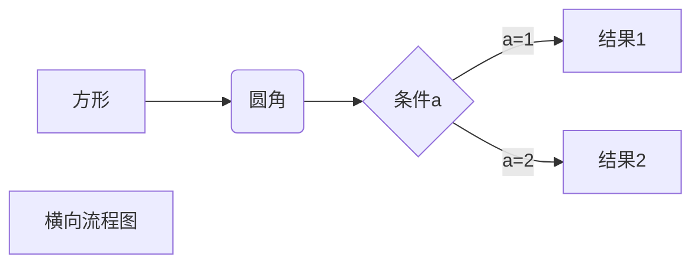
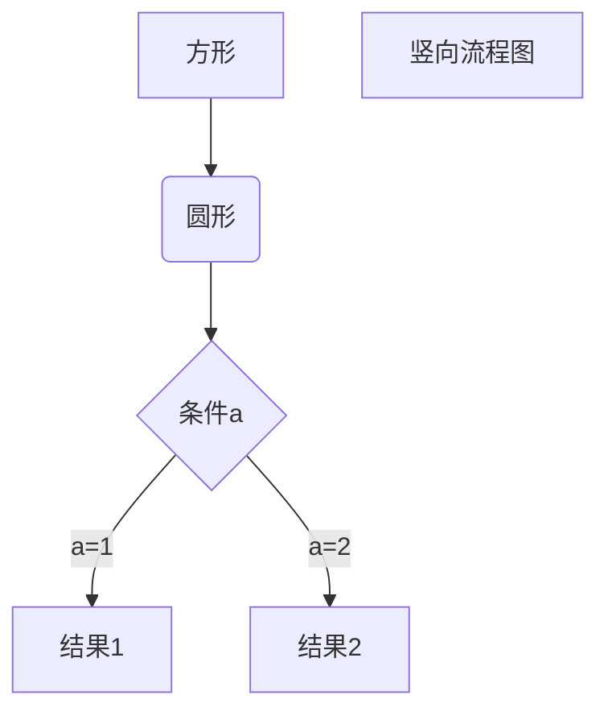

Mardown语法
===========

## Mardown 标题

一级标题
\===
二级标题
\---

### 使用‘#’号标记

使用‘#’号可以表示1-6级标题

## Markdown段落

Markdown段落没有特殊格式，直接编辑文字，**段落的换行使用两个以上的空格加上回车**。当然也可以在段落后面使用一个空行来重新表示一个段落。

## Markdown字体

*斜体文字*
_斜体文字_
**粗体文字**
__粗体文字__
***斜粗体文字***
___斜粗体文字___

## 分割线

\***

---

\******

---

\---

---

\___

---

## 删除线

如果段落上的文字要添加删除线，可以在文字的两端加上两个~~即可。
~~删除文字~~

## 下划线

下划线可以通过html的\<u>标签来实现
`<u>`带下划线的文字`</u>`

## 脚注

脚注是对文字的补充说明。 Markdown脚注的实现：
创建脚注格式类似这样 [^RUNOOB]。

[^RUNOOB]: Markdown教程说明！！
    
## Markdown列表

Markdown支持有序列表和无序列表。无序列表使用\*,\+,\-作为列表标记，在这些标记后面要添加一个空格，然后填写内容

* 第一项内容

+ 第一项内容

- 第一项内容

有序列表使用数字加上\.号来表示

1. 第一项内容
2. 第二项内容

### 列表嵌套

列表嵌套只需要在子列表前面添加两个或者四个空格即可

1. 第一项：
   - 第一项嵌套的内容
   - 第二项嵌套的内容
2. 第二项
   - 第一项嵌套的内容
   - 第二项嵌套的内容

## Markdown区块

Markdown区块引用是在段落开头使用\>符号，然后紧跟一个空格符号

> 区块引用
> 学习的不仅仅是技术

另外区块还可以嵌套的，一个\>符号是最外层，两个\>符号是第一层嵌套，以此类推

> 最外层
>
>> 第一层嵌套
>>
>>> 第二层嵌套
>>>
>>

### 区块中使用列表

区块中使用列表

> 区块中使用列表
>
> 1. 第一项
> 2. 第二项
>
> * 第一项
> * 第二项

### 在列表中使用区块

* 第一项
  > 区块内容
  > 学校永无止境
  >
* 第二项

## Markdown代码块

使用\```包裹一段代码，并指定一种语言

```javascript
$(document).ready(function()){
    alter('RUNOOB')
}
```

还可以使用四个空格或者一个制表符

    <?php
        echo 'RUNOOB';
        function test(){
            echo 'test'
        }

Markdown链接

链接的使用方法
[链接名称](链接地址)
或者
<链接地址>

这是一个链接[github](https://www.github.com)
或者
[https://github.com](https://github.com)

### 高级链接

我们可以通过变量来设置一个链接，变量在文档末尾进行
这个链接用1作为网址变量[Google][1]
这个链接使用runoob作为网址变量[Runoob][runoob]
然后在文档结尾为变量赋值

[1]: http://google.com
[runoob]: http://runoob.com
## Markdown图片

图片格式如下\

* 开头一个感叹号
* 接着一个方括号，里面放置图片代替的文字
* 接着一个普通括号，里面放上图片网址，最后还可以使用引号加上选择的title属性文字

For example:


也可以像网址那样对图片网址使用变量

这个链接用1作为网址变量[RUNOOB][1].
然后在结尾为变量赋值

[1]: ./pic/download.jpeg
Markdown还没有办法制定图片的高度和宽度，如果需要，可以使用图片的\标签。
``

## Markdown表格

Markdown制作表格使用\|来分割不同单元格，使用\-来分隔表头和其他行  

| 表头   | 表头   |
| ------ | ------ |
| 单元格 | 单元格 |
| 单元格 | 单元格 |

**对齐方式：**

* \-: 右对齐
* \:- 左对齐
* \:-: 居中对齐

| 左对齐 | 右对齐 | 居中对齐 |
| :----- | -----: | :------: |
| 单元格 | 单元格 |  单元格  |
| 单元格 | 单元格 |  单元格  |

## Markdown高级技巧

不在Markdown涵盖范围内的标签，可以直接在文档里面使用HTML撰写。
目前支持的HTML元素有：\<kbd> \<b> \<i> \<em> \<sup> \<sub> \<br>等。
使用`<kbd>`Ctrl`</kbd>`+`<kbd>`Alt`</kbd>`+`<kbd>`Del`</kbd>`重启电脑

### 转义

Markdown使用了很多特殊符号来表示特定的意义，如果需要显示特定的符号需要使用转义字符，Markdown使用反斜杠转义特殊字符。
*斜体字符*
\*正常显示\*

### 公式

默认下的分割符：

* \$ ...\$ 在行内显示
* \$\$...\$\$ 或者\```math 在块中显示

$f(x)=sin(x) +1$

```math
f(x) = sin(x) + 1
```

$$
f(x)=\sum_{1}^{100} x
$$

$$
\begin{Bmatrix}
a&b \\
c&d
\end{Bmatrix}
$$

$$
\begin{CD}
    A @>a>> B \\
    @VbVV @AAcA \\
    C @= D
\end{CD}
$$

### 流程图




